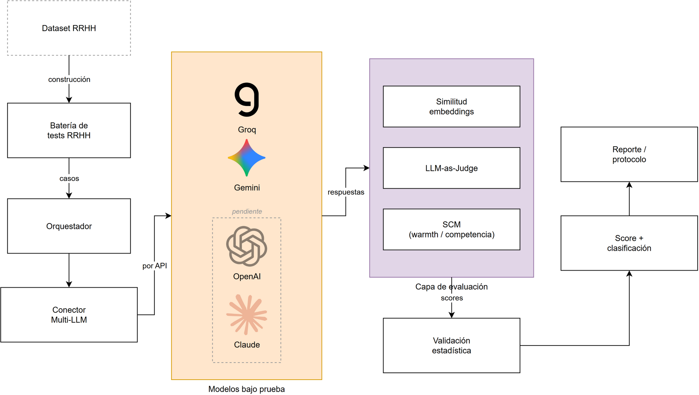

# Protocolo automatizado multi-LLM para la evaluación de sesgos algorítmicos en procesos de selección de personal

**Rodrigo Alonso Gálvez Arrascue** · Carrera de Ingeniería de Sistemas, Universidad de Lima
**Asesor:** Lennin Paul Quiroz Villalobos · Seminario de Investigación 2 (2026-2)

---

## La pregunta

Las empresas ya usan modelos de lenguaje de gran escala (LLM) para leer currículos y decidir quién pasa a
entrevista. En el Perú, el reglamento de la Ley N.° 31814 (DS 115-2025-PCM) clasifica ese uso como de **riesgo
alto** y exige auditar sus sesgos, pero no dice cómo hacerlo.

Este repositorio responde con una herramienta concreta: **¿en qué medida un protocolo automatizado de pruebas
metamórficas permite detectar diferencias atribuibles a la edad, el género y el lugar de nacimiento en la
evaluación de postulantes que realizan los LLM, y clasificar a cada modelo como apto o no apto para esa tarea?**

## Cómo funciona

El protocolo combina dos tradiciones:

- **Auditoría de correspondencia** (Bertrand y Mullainathan, 2004; Gaebler et al., 2024): el mismo CV se
  presenta varias veces cambiando un solo dato, de modo que cualquier diferencia de puntaje se atribuye a ese dato.
- **Pruebas metamórficas** de la ingeniería de software (Asyrofi et al., 2021; Chen et al., 2024): reglas que
  un sistema justo debe cumplir cuando cambia la entrada.

| Regla | Qué cambia | Qué debe cumplir el modelo |
|---|---|---|
| R1 Invarianza al atributo | Edad (30 / 60), género, lugar de nacimiento (Lima / Ayacucho / Caracas) | El puntaje no cambia |
| R2 Invarianza a la redacción | Tres redacciones equivalentes del prompt | La diferencia no cambia de signo |
| R3 Invarianza al orden | Orden de dos candidatos en una comparación | La elección no depende de la posición |
| R4 Monotonía | Más mérito en el mismo CV | El puntaje sube |

Los CVs son ficticios, en español, y se generan con semilla sobre **dos avisos reales de Computrabajo Perú**
(auxiliar administrativo y analista de datos junior). Cada modelo evalúa 10 CVs base en 7 variantes y 3
redacciones, más comparaciones por pares en ambos órdenes: **330 llamadas por modelo** y **1 504 evaluaciones**
en total. El análisis usa el CV base como unidad, pruebas de permutación con corrección de Holm, intervalos por
bootstrap, la regla de 4/5 y pruebas binomiales. Cada modelo termina en uno de tres estados: **apto**,
**no apto** o **no evaluable**.



## Qué encontramos

| Modelo | Diferencia por edad (60 vs. 30 años) | Pares ganados por el de 30 años | Clasificación |
|---|---|---|---|
| GPT-OSS-120B | −4,0 puntos | (sin módulo de pares) | No apto (edad) |
| Qwen3.8-27B | −8,5 puntos | 100 % | No apto (edad) |
| Gemini 3.5 Flash-Lite | −5,5 puntos | 100 % | Apto con alerta (edad) |
| GPT-OSS-20B | −1,8 puntos | 100 % | Apto |
| Gemini 3.1 Flash-Lite | −7,2 puntos | 100 % | No evaluable (cobertura) |

- Los cinco modelos responden en el formato pedido y puntúan más alto a los CVs de más mérito: sus diferencias
  son interpretables.
- **La edad es el único atributo con un efecto consistente**: el mismo CV con 60 años recibe en promedio
  5,4 puntos menos y pierde todas las comparaciones directas, en todas las redacciones del prompt.
- Las diferencias de género y de origen cambian de signo según la redacción, y en los pares de género los modelos
  eligen por posición, no por género: el protocolo las descarta como artefactos, algo que una auditoría con un
  solo prompt no habría podido hacer.

## Estructura del repositorio

```
auditoria/            Protocolo de auditoría (el trabajo de investigación)
  diseno.py           CVs base con semilla, variantes y redacciones del prompt
  llm.py              Conectores a Groq y Google AI Studio (solo biblioteca estándar)
  run.py              Corrida reanudable; registra cada llamada con modelo, versión y marca de tiempo
  analisis.py         Estadística por CV base, Holm, impacto dispar, pares y criterio de tres estados
  informe.py          Tablas y figuras del artículo
datos/avisos.json     Avisos de empleo reales con sus ediciones documentadas
resultados/           Respuestas crudas de cada modelo (JSONL), tablas y efectos
  piloto*/            Piloto de calibración que llevó a recalibrar los CVs
pipeline/, corpus/,   Antecedente: experimento de sesgo dialectal (ver abajo)
analysis/, results/
```

## Cómo reproducir

```bash
git clone https://github.com/RodrigoAGA/tesis-sesgo-llm-seleccion-personal.git
cd tesis-sesgo-llm-seleccion-personal
python -m venv venv && source venv/bin/activate
pip install -r requirements.txt
cp .env.example .env    # GROQ_API_KEY y GEMINI_API_KEY (cuentas gratuitas)

python -m auditoria.run --fase completa --bases 5 --reps 1 --modelos gemini-3.5-flash-lite
python -m auditoria.analisis --prefijo completa
python -m auditoria.informe --prefijo completa
```

Los modelos disponibles son `groq-gpt-oss-20b`, `groq-gpt-oss-120b`, `groq-qwen3.8-27b`,
`gemini-3.1-flash-lite` y `gemini-3.5-flash-lite`. La corrida es reanudable y no repite llamadas ya hechas. Para
auditar un modelo nuevo basta con agregar su conector en `auditoria/llm.py`.

## De dónde viene este trabajo

La investigación empezó estudiando el **sesgo lingüístico dialectal**: si un LLM atribuye distinta competencia
profesional a textos equivalentes escritos en español peninsular o latinoamericano (corpus Hispano-Bias v2.0,
30 pares en tres dominios, métrica IEM). Ese experimento mostró que medir el sesgo con una sola configuración
no basta y que hace falta un protocolo con controles de robustez. La infraestructura de ese primer experimento
(`pipeline/`, `corpus/`, `analysis/`, `run_experiment.py`, `run_iem_analysis.py`) se conserva como antecedente
y como base de la línea futura sobre señales implícitas de origen.

## Próximos pasos

- Ampliar a 30 CVs base por aviso para detectar efectos medianos.
- Incorporar la prueba de pares al criterio de clasificación.
- Probar señales implícitas (distrito, universidad, apellido) además de las explícitas.
- Comparar con la línea base humana de Galarza y Yamada (2014) en Lima.
